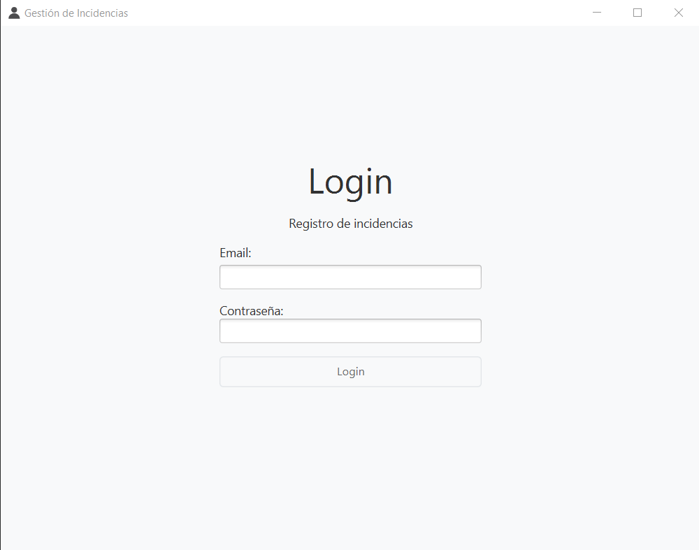
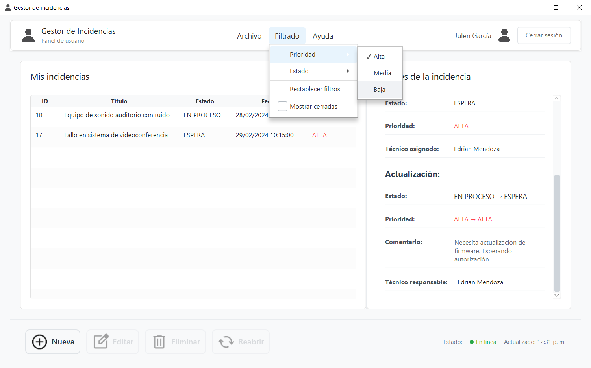
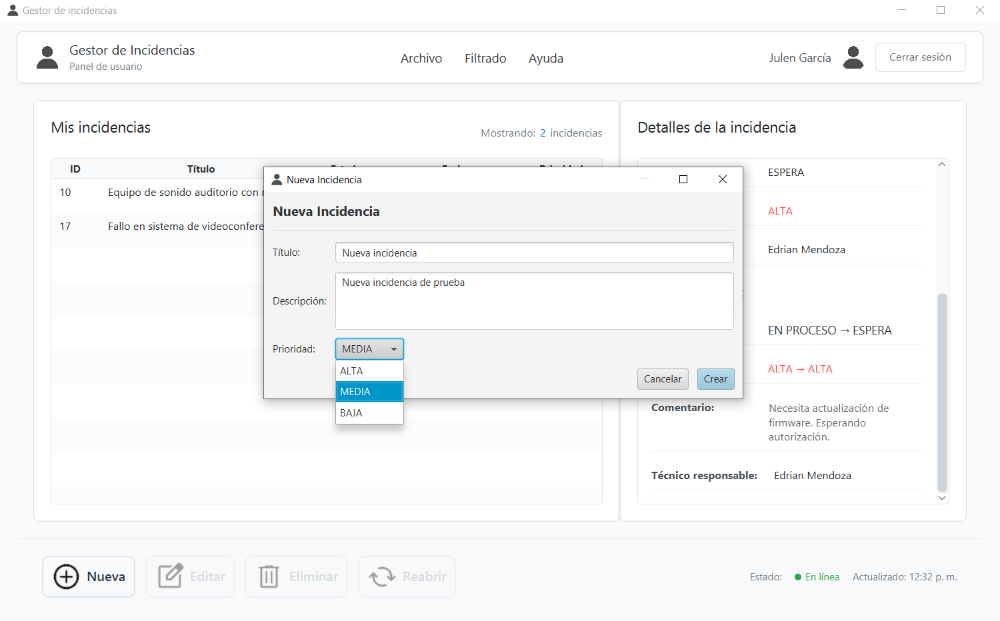
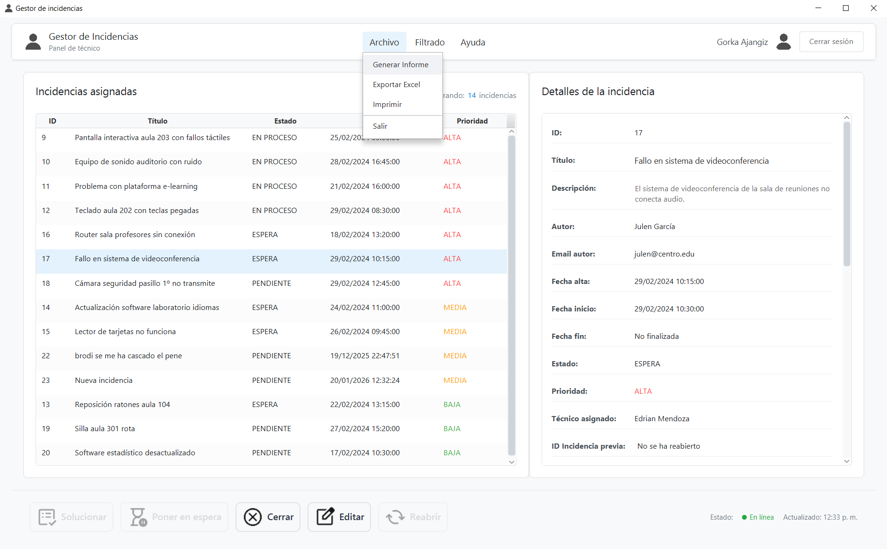
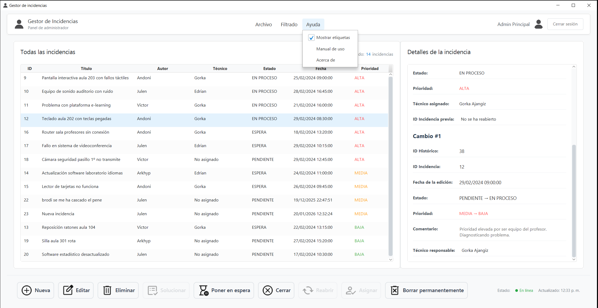

<h1 align="center">Gestor de Incidencias</h1>

Aplicación de escritorio desarrollada en <strong>JavaFX</strong> para la gestión de incidencias en un entorno empresarial.

<h2>📌 Descripción del proyecto</h2>

Este proyecto fue desarrollado como trabajo de clase con el objetivo de crear una aplicación capaz de gestionar
incidencias en una empresa real. Se nos dio la opción de utilizar Swing o JavaFX por un punto más, por lo que la hice
completamente en <strong>JavaFX</strong>.

Se han implementado todos los objetivos obligatorios y opcionales, además de múltiples mejoras a nivel de diseño,
arquitectura y usabilidad.

---

<h2>🛠️ Características principales</h2>

<ul>
  <li>Arquitectura basada en <strong>MVC (Modelo, vista, controlador)</strong> implementados manualmente</li>
  <li>Documentación completa mediante <strong>Javadoc</strong></li>
  <li>Gestión de errores y pruebas de funcionamiento</li>
  <li>Filtros avanzados por estado y prioridad</li>
  <li>Histórico de cambios por incidencia</li>
  <li>Generación de informes en formato <code>.txt</code></li>
  <li>Actualización automática cada 60 segundos</li>
  <li>Elementos visuales adicionales (reloj, logos, ajustes de interfaz)</li>
</ul>

---

<h2>👥 Roles y permisos</h2>

<h3>Usuario</h3>
<ul>
  <li>Crear incidencias</li>
  <li>Editar y eliminar incidencias (baja lógica)</li>
  <li>Reabrir incidencias cerradas</li>
</ul>

<h3>Técnico</h3>
<ul>
  <li>Solucionar, poner en espera y cerrar incidencias</li>
  <li>Reabrir incidencias</li>
  <li>Editar la prioridad</li>
</ul>

<h3>Administrador</h3>
<ul>
  <li>Acceso completo a todas las funcionalidades anteriores</li>
  <li>Asignar técnicos a incidencias</li>
  <li>Eliminar incidencias de forma permanente</li>
</ul>

---

<h2>🔐 Cuentas de acceso (base de datos de ejemplo)</h2>

<table>
  <tr>
    <th>Rol</th>
    <th>Usuario</th>
    <th>Contraseña</th>
  </tr>
  <tr>
    <td rowspan="5">Usuario</td>
    <td>andoni@centro.edu</td>
    <td>123</td>
  </tr>
  <tr><td>julen@centro.edu</td><td>123</td></tr>
  <tr><td>victor@centro.edu</td><td>123</td></tr>
  <tr><td>arkhyp@centro.edu</td><td>123</td></tr>
  <tr><td>sergio@centro.edu</td><td>123</td></tr>

  <tr>
    <td rowspan="2">Técnico</td>
    <td>gorka@centro.edu</td>
    <td>123</td>
  </tr>
  <tr><td>edrian@centro.edu</td><td>123</td></tr>

  <tr>
    <td>Administrador</td>
    <td>admin@centro.edu</td>
    <td>123</td>
  </tr>
</table>

---

<h2>🖥️ Capturas de la aplicación</h2>

<h3>Login</h3>

<h3>Panel de usuario</h3>

<h3>Creación de incidencia</h3>

<h3>Panel de técnico</h3>

<h3>Panel de administrador</h3>

